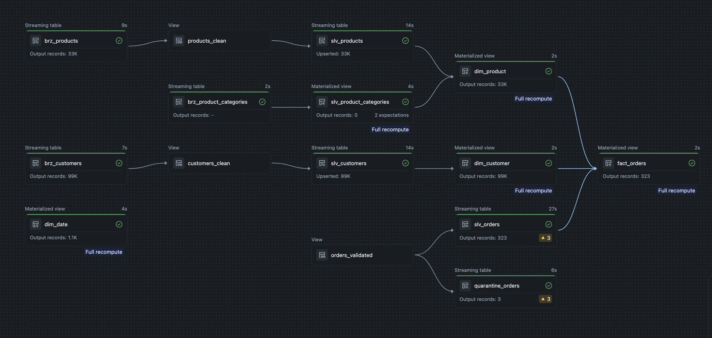

# Ecommerce Data Pipeline

End to end ecommerce data pipeline built with **Databricks**, **Lakeflow Declarative Pipelines**, **Databricks Zerobus**, **Azure DevOps** and **Power BI**.

Order events are sent to Databricks through Zerobus. The data is processed through Bronze, Silver and Gold layers and exposed to Power BI for reporting.

## Table of Contents

* [Overview](#overview)
* [Architecture](#architecture)
* [Medallion Architecture](#medallion-architecture)
* [Technology Stack](#technology-stack)
* [Project Structure](#project-structure)
* [Prerequisites](#prerequisites)
* [Local Setup](#local-setup)
* [Environment Variables](#environment-variables)
* [Running the Producer](#running-the-producer)
* [Data Quality Testing](#data-quality-testing)
* [Producer CLI](#producer-cli)
* [Unit Tests](#unit-tests)
* [Integration Tests](#integration-tests)
* [Reconciliation](#reconciliation)
* [Data Quality Alert](#data-quality-alert)
* [Row Level Security](#row-level-security)
* [Development and Production](#development-and-production)
* [CI/CD](#cicd)
* [Power BI](#power-bi)
* [Validation](#validation)
* [Troubleshooting](#troubleshooting)
* [Security](#security)
* [Databricks Resources](#databricks-resources)

## Overview

```text
CSV Source Data
      │
      ▼
Python Order Producer
      │
      ▼
Databricks Zerobus
      │
      ▼
Bronze
      │
      ▼
Silver
      │
      ▼
Gold
      │
      ▼
Databricks SQL
      │
      ▼
Power BI
```

The diagram below shows the deployed Lakeflow pipeline graph, generated by Databricks:



Lakeflow Declarative Pipelines handle the transformation layer. Unity Catalog provides governance and access control.

Databricks Asset Bundles manage the project resources. Azure DevOps runs the tests and deploys the bundle to development and production.

## Architecture

### Order Producer

The producer is written in Python and reads order and order item data from CSV files.

Each `order_id + product_id` combination becomes an order event and is sent directly to the Bronze table through Zerobus.

The producer supports finite and continuous execution.

### Finite Mode

Send a fixed number of events and stop.

```bash
uv run --env-file .env python src/producer/order_event_producer.py \
  --num-events 250
```

### Continuous Mode

Keep sending events until the process is stopped manually.

```bash
uv run --env-file .env python src/producer/order_event_producer.py \
  --continuous
```

Stop it with:

```text
Ctrl+C
```

The Zerobus stream is closed before the producer exits.

### Example Event

```json
{
  "order_id": "example-order-id",
  "customer_id": "example-customer-id",
  "product_id": "example-product-id",
  "quantity": 1,
  "price": 120.50,
  "order_timestamp": "2018-08-15T10:30:00+00:00",
  "discount_code": "WELCOME10",
  "ingest_datetime": "2026-08-24T09:30:00+00:00"
}
```

`order_timestamp` comes from the source order.

`ingest_datetime` is generated when the event is sent to Databricks.

## Medallion Architecture

### Bronze

Bronze receives raw order events through Zerobus.

Development table:

```text
dbr_dev.ecommerce_bronze.brz_orders
```

Customer and product source data also enters through Bronze.

### Silver

Silver contains cleaned and validated data.

Main Silver tables:

```text
slv_customers
slv_products
slv_product_categories
slv_orders
quarantine_orders
```

`slv_customers` and `slv_products` clean and validate their source fields and keep historical changes using SCD logic. `slv_product_categories` is a batch table of the category name translations. Records failing quality checks in these three tables are dropped.

The orders flow applies quality rules before records are used downstream.

Current order quality rules:

```text
order_id IS NOT NULL
customer_id IS NOT NULL
product_id IS NOT NULL
quantity IS NOT NULL AND quantity > 0
price IS NOT NULL AND price >= 0
```

Valid records continue to `slv_orders`.

Invalid records are stored in `quarantine_orders`, not dropped.

Orders are deduplicated using:

```text
order_id + product_id
```

### Quarantine

Rejected order events are preserved instead of being dropped.

Examples:

```text
quantity = 0
quarantine_reason = quantity must be greater than 0
```

```text
price = -10
quarantine_reason = price must be greater than or equal to 0
```

```text
customer_id = null
quarantine_reason = customer_id is null
```

### Gold

Gold contains the star schema used for analytics.

Main tables:

```text
fact_orders
dim_date
dim_customer
dim_product
```

`fact_orders` is the central fact table.

```text
dim_customer ─── fact_orders ─── dim_product
```

The core transformation logic is kept separate from the Lakeflow resource definitions so it can be tested independently.

## Technology Stack

| Area                   | Technology                                    |
| ----------------------- | ----------------------------------------------- |
| Language                | Python                                          |
| Dependency management   | uv                                              |
| Data platform           | Azure Databricks                                |
| Streaming ingestion     | Databricks Zerobus                              |
| Processing              | Apache Spark and PySpark                        |
| Pipelines               | Lakeflow Declarative Pipelines                  |
| Storage                 | Delta Lake                                      |
| Governance              | Unity Catalog                                   |
| Data quality            | Lakeflow expectations and Databricks Labs DQX   |
| Testing                 | pytest and Databricks Connect                   |
| Deployment              | Databricks Asset Bundles                        |
| CI/CD                   | Azure DevOps                                    |
| Analytics               | Databricks SQL                                  |
| Reporting               | Power BI                                        |

## Project Structure

```text
ecommerce_pipeline_demo/
│
├── data/
│   ├── customers/
│   ├── order_items/
│   ├── orders/
│   ├── product_category_name/
│   └── products/
│
├── env/
│   ├── dev.yml
│   ├── prod.yml
│   └── variables.yml
│
├── images/
│   └── pipeline_graph.png
│
├── resources/
│   ├── alerts/
│   ├── jobs/
│   ├── pipelines/
│   ├── schemas/
│   └── volumes/
│
├── src/
│   ├── data_quality/
│   │   ├── checks/
│   │   ├── reconciliation/
│   │   └── run_dqx.py
│   ├── governance/
│   ├── producer/
│   │   └── order_event_producer.py
│   ├── setup/
│   │   ├── create_orders_bronze.sql
│   │   └── grant_zerobus_permissions.sql
│   └── transformations/
│       ├── bronze/
│       ├── silver/
│       └── gold/
│
├── tests/
│   ├── integration/
│   │   ├── test_gold_pipeline.py
│   │   └── test_orders_pipeline.py
│   └── unit/
│       ├── test_fact_orders.py
│       ├── test_orders.py
│       ├── test_slv_customers.py
│       └── test_slv_products.py
│
├── .gitignore
├── azure-pipelines.yml
├── databricks.yml
├── pyproject.toml
├── uv.lock
└── README.md
```

Local files such as `.env`, `.venv`, `.databricks`, `.pytest_cache`, `.ruff_cache`, `.vscode` and `__pycache__` should not be committed.

## Prerequisites

You need:

```text
Python 3.11
uv
Git
Azure Databricks workspace access
Databricks Service Principal
Zerobus endpoint
```

Check the local tools with:

```bash
python --version
uv --version
git --version
```

## Local Setup

Clone the repository:

```bash
git clone <repository-url>
cd ecommerce_pipeline_demo
```

Install the project dependencies:

```bash
uv sync
```

## Environment Variables

The producer reads its configuration from environment variables.

A local `.env` can contain:

```text
ZEROBUS_SERVER_ENDPOINT=<zerobus-server-endpoint>
DATABRICKS_WORKSPACE_URL=<databricks-workspace-url>
DATABRICKS_CLIENT_ID=<service-principal-client-id>
DATABRICKS_CLIENT_SECRET=<service-principal-client-secret>
ZEROBUS_TABLE_NAME=dbr_dev.ecommerce_bronze.brz_orders
```

`.env` must stay in `.gitignore`.

The Databricks Service Principal used by Zerobus needs access to the target catalog, schema and table.

## Running the Producer

Run the producer from the project root.

### Default

```bash
uv run --env-file .env python src/producer/order_event_producer.py
```

This sends 20 events.

### Fixed Number of Events

```bash
uv run --env-file .env python src/producer/order_event_producer.py \
  --num-events 250
```

### Continuous Mode

```bash
uv run --env-file .env python src/producer/order_event_producer.py \
  --continuous
```

### Custom Batch Configuration

```bash
uv run --env-file .env python src/producer/order_event_producer.py \
  --num-events 250 \
  --min-batch-size 1 \
  --max-batch-size 8 \
  --min-batch-delay 0.3 \
  --max-batch-delay 2.5 \
  --include-discount-code
```

## Data Quality Testing

The producer can inject one invalid event to test the Silver quality rules and quarantine flow.

### Quantity Equal to Zero

```bash
uv run --env-file .env python src/producer/order_event_producer.py \
  --num-events 20 \
  --invalid-event quantity-zero
```

### Negative Price

```bash
uv run --env-file .env python src/producer/order_event_producer.py \
  --num-events 20 \
  --invalid-event negative-price
```

### Missing Customer

```bash
uv run --env-file .env python src/producer/order_event_producer.py \
  --num-events 20 \
  --invalid-event missing-customer-id
```

Only one event is modified during each execution.

```text
Producer
   │
   ▼
Zerobus
   │
   ▼
Bronze
   │
   ▼
Quality Rules
   │
   ├── Valid ─────► slv_orders
   │
   └── Invalid ───► quarantine_orders
```

The quarantine table keeps the rejected record together with `quarantine_reason`.

## Producer CLI

| Argument                    | Default                              | Description                  |
| ----------------------------- | -------------------------------------- | ------------------------------- |
| `--orders-path`               | `data/orders/orders.csv`               | Orders source file              |
| `--order-items-path`          | `data/order_items/order_items.csv`     | Order items source file         |
| `--num-events`                | `20`                                   | Number of events to send        |
| `--continuous`                | Disabled                               | Keep sending until `Ctrl+C`     |
| `--min-batch-size`            | `1`                                    | Minimum batch size              |
| `--max-batch-size`            | `10`                                   | Maximum batch size              |
| `--min-batch-delay`           | `0.3`                                  | Minimum delay in seconds        |
| `--max-batch-delay`           | `2.5`                                  | Maximum delay in seconds        |
| `--include-discount-code`     | Disabled                               | Add random discount codes       |
| `--invalid-event`             | Disabled                               | Inject one invalid event        |

`--num-events` and `--continuous` cannot be used together.

## Unit Tests

Unit tests validate the transformation functions without depending on a deployed Databricks pipeline.

Run them with:

```bash
uv run --group unit-tests --frozen pytest tests/unit -v
```

The current suite covers order preparation, customer cleanup, product cleanup and Gold fact logic.

## Integration Tests

Integration tests validate the deployed data flow using Databricks Connect and serverless compute.

Run them with:

```bash
uv run --group integration-tests --frozen pytest tests/integration -v
```

The current integration suite checks the orders flow from Bronze to Silver and quarantine. It also checks that Silver orders are available in `fact_orders`.

## Reconciliation

Reconciliation queries are stored in:

```text
src/data_quality/reconciliation/bronze_to_silver.sql
src/data_quality/reconciliation/silver_to_gold.sql
```

They compare records across the medallion layers and help confirm that expected records reach the correct destination.

## Data Quality Alert

The data quality alert is stored in:

```text
resources/alerts/order_data_quality.yml
```

It checks `quarantine_orders` for recently rejected records.

Trigger condition:

```text
invalid_records > 0
```

The alert is deployed with the Databricks Asset Bundle.

## Row Level Security

Governance SQL is stored under:

```text
src/governance/
```

Access to Gold is restricted at two levels:

* **Row Level Security (RLS)** — a secure view filters `fact_orders` by account group membership, and the underlying tables are not directly grantable to restricted principals.
* **Column Level Security (CLS)** — sensitive columns on Gold dimensions (such as `customer_unique_id`) are masked for principals outside the authorized group.

The security layer is kept outside the Lakeflow transformation logic. This keeps pipeline processing separate from access control.

## Development and Production

Environment configuration is stored in:

```text
env/dev.yml
env/prod.yml
env/variables.yml
```

Bundle variables include:

```text
catalog
bronze_schema
silver_schema
gold_schema
landing_storage_location
sql_warehouse_id
zerobus_principal_id
```

The same project can be deployed to development and production with environment specific values.

## CI/CD

Azure DevOps runs the automated test and deployment flow.

### Development

A push to `main` runs unit tests before deploying to development.

```text
Push to main
      │
      ▼
Unit Tests
      │
      ▼
Validate DEV
      │
      ▼
Deploy DEV
      │
      ▼
Integration Tests
```

A failed unit test stops the deployment.

A failed integration test marks the development pipeline as failed after deployment.

### Production

Production deployment is triggered with a version tag.

Example:

```bash
git tag v1.0.0
git push azure v1.0.0
```

```text
Git tag v*
      │
      ▼
Unit Tests
      │
      ▼
Validate PROD
      │
      ▼
Deploy PROD
```

A normal push to `main` does not deploy to production.

## Power BI

Power BI connects to the Gold layer through a Databricks SQL Warehouse.

The reporting model follows the Gold star schema.

```text
dim_customer ─── fact_orders ─── dim_product
```

The model supports analysis of orders, revenue, customers and products.

## Validation

### Bronze

```sql
SELECT COUNT(*)
FROM <catalog>.<bronze_schema>.brz_orders;
```

Latest events:

```sql
SELECT *
FROM <catalog>.<bronze_schema>.brz_orders
ORDER BY ingest_datetime DESC
LIMIT 20;
```

### Silver

```sql
SELECT COUNT(*)
FROM <catalog>.<silver_schema>.slv_orders;
```

### Quarantine

```sql
SELECT *
FROM <catalog>.<silver_schema>.quarantine_orders
ORDER BY ingest_datetime DESC;
```

### Gold

```sql
SELECT COUNT(*)
FROM <catalog>.<gold_schema>.fact_orders;
```

### Unit Tests

```bash
uv run --group unit-tests --frozen pytest tests/unit -v
```

### Integration Tests

```bash
uv run --group integration-tests --frozen pytest tests/integration -v
```

## Troubleshooting

### Missing Zerobus Endpoint

```text
RuntimeError: ZEROBUS_SERVER_ENDPOINT environment variable is required
```

Run the producer with the local `.env`:

```bash
uv run --env-file .env python src/producer/order_event_producer.py
```

### Continuous Mode Reuses Orders

Continuous mode uses the complete source event pool.

When it reaches the end it reshuffles the events and starts another cycle.

This means the same `order_id + product_id` can appear again during long runs.

Silver handles duplicates using the order and product key.

### Requested Number of Events Is Too Large

If `--num-events` is greater than the available source event pool the producer stops with an error.

### Databricks Connect Authentication

Integration tests require a valid Databricks host and OAuth M2M credentials.

Azure DevOps provides:

```text
DATABRICKS_HOST
DATABRICKS_CLIENT_ID
DATABRICKS_CLIENT_SECRET
DATABRICKS_AUTH_TYPE
DATABRICKS_SERVERLESS_COMPUTE_ID
```

## Security

Do not store credentials in Python code.

Do not commit `.env`, client secrets or access tokens.

Development and production credentials should be stored as secure Azure DevOps variables.

The Zerobus Service Principal should only have the permissions required by the producer and deployment flow.

## Databricks Resources

Lakeflow Pipeline

Bronze Setup Job